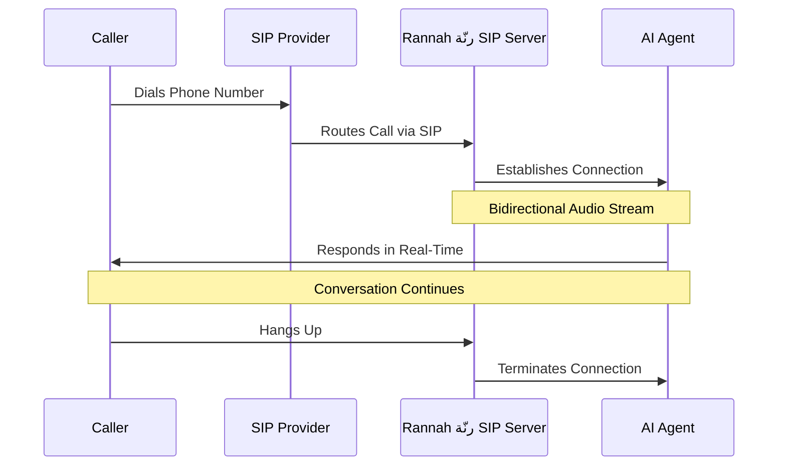

# Understanding the SIP Server

Rannah رنّة provides a fully managed SIP server that bridges calls from your SIP trunk provider to your AI agents. This page explains how it works behind the scenes.

## What is the SIP Server?

The SIP server (running Asterisk) is the communication bridge that:

- **Receives calls** from your SIP trunk provider
- **Processes audio** in real-time
- **Routes calls** to the correct AI agent
- **Manages the connection** between telephony and AI

**[IMAGE PLACEHOLDER: Diagram showing SIP server's role in the call flow]**
_Filename suggestion: `asterisk-role-diagram.png`_
_Description: Architecture diagram showing: SIP Provider → Rannah رنّة SIP Server (with boxes for SIP Handler, Audio Processor, Call Router) → Rannah رنّة AI Agent_

<Note>
  **Important**: The SIP server is fully managed by Rannah رنّة. You don't need to
  install, configure, or maintain anything.
</Note>

## Server Details

Your SIP provider should route calls to:

```text
IP Address: 134.209.121.168
Port: 5060
Protocol: UDP (SIP)
```

## How It Works

### Call Flow

When someone calls your phone number:



### Step-by-Step Process

<Steps>
  <Step title="Call Arrives">
    Your SIP provider receives an incoming call and routes it to
    `134.209.121.168:5060`
  </Step>

  <Step title="Number Lookup">
    The SIP server looks up the phone number in Rannah رنّة's database to find the
    assigned agent
  </Step>

  <Step title="Agent Connection">
    The server establishes a WebSocket connection to the assigned AI agent
  </Step>

  <Step title="Audio Bridge">
    Audio flows bidirectionally: - Caller's voice → SIP Server → AI Agent - AI
    Agent's response → SIP Server → Caller
  </Step>

  <Step title="Real-Time Processing">
    The AI agent processes speech, generates responses, and speaks back through
    the bridge
  </Step>

  <Step title="Call Termination">
    When either party hangs up, the connection is cleanly terminated
  </Step>
</Steps>

## Technical Architecture

### Components

<CardGroup cols={2}>
  <Card title="SIP Handler" icon="phone">
    Manages SIP signaling (call setup, teardown, etc.)
  </Card>

  <Card title="Audio Engine" icon="waveform">
    Processes PCM16 8kHz mono audio streams
  </Card>

  <Card title="Call Router" icon="route">
    Routes calls to the correct AI agent based on phone number
  </Card>

  <Card title="WebSocket Bridge" icon="plug">
    Connects to Rannah رنّة's AI agent infrastructure
  </Card>
</CardGroup>

### Audio Processing

The server handles audio format conversion:

- **Input**: Various codecs from your SIP provider (PCMU, PCMA, etc.)
- **Processing**: Converts to PCM16 8kHz mono
- **Output**: Sends to AI agent in optimal format
- **Response**: Converts AI agent audio back to SIP-compatible format

### Supported Codecs

The SIP server supports standard telephony codecs:

- ✅ **PCMU (G.711 μ-law)** - North America standard
- ✅ **PCMA (G.711 A-law)** - International standard
- ✅ **Opus** - High-quality, low-latency
- ✅ **G.722** - Wideband audio

## Network Requirements

### For Your SIP Provider

Your SIP provider needs to:

<Checklist>
  - [ ] Support outbound SIP trunk routing - [ ] Allow routing to custom IP
  addresses - [ ] Support UDP on port 5060 - [ ] Have compatible codec support
  (PCMU/PCMA minimum) - [ ] Not require IP whitelisting (or whitelist
  134.209.121.168)
</Checklist>

### Firewall Rules

The Rannah رنّة SIP server has proper firewall rules configured:

- **Inbound SIP:** Port 5060 (UDP) - Open to SIP providers
- **Inbound RTP:** Ports 10000-20000 (UDP) - For audio
- **Outbound:** HTTPS/WSS to Rannah رنّة AI infrastructure

You don't need to configure any firewall rules on your end - just point your SIP provider to the server.

## Server Management

### What Rannah رنّة Manages

<CardGroup cols={2}>
  <Card title="Server Uptime" icon="check">
    99.9% uptime guarantee with monitoring
  </Card>

  <Card title="Software Updates" icon="arrow-up">
    Automatic security and feature updates
  </Card>

  <Card title="Security" icon="shield">
    Firewall, fail2ban, and intrusion detection
  </Card>

  <Card title="Scaling" icon="chart-line">
    Auto-scaling for high call volumes
  </Card>

  <Card title="Monitoring" icon="eye">
    24/7 monitoring and alerting
  </Card>

  <Card title="Backups" icon="database">
    Regular configuration backups
  </Card>
</CardGroup>

### What You Don't Need to Worry About

- ❌ Server installation or configuration
- ❌ Software updates or patches
- ❌ SSL certificates
- ❌ Firewall configuration
- ❌ Network troubleshooting
- ❌ Capacity planning
- ❌ Security hardening
- ❌ Log management

## Performance & Reliability

### Call Quality

The SIP server is optimized for:

- **Low Latency**: < 100ms processing time
- **High Quality**: 8kHz audio, clear voice reproduction
- **Reliability**: 99.9% uptime SLA
- **Concurrent Calls**: Supports hundreds of simultaneous calls

### Geographic Distribution

- **Primary Server**: 134.209.121.168
- **Location**: Optimally located for minimal latency
- **Network**: High-speed, redundant connections
- **CDN**: Audio optimized for global delivery

## Monitoring Your Calls

### Call Logs

All calls through the SIP server are logged in your Rannah رنّة dashboard:

- View in **Conversations** tab
- Filter by phone number
- See call duration
- Access transcripts
- Review AI agent performance

### Metrics Available

Track these metrics for your SIP trunk:

- Total calls received
- Average call duration
- Success rate
- Failed call reasons
- Peak calling times
- Geographic distribution of callers

## Common Questions

<AccordionGroup>
  <Accordion title="Can I use my own SIP server?">
    No, all SIP trunking uses Rannah رنّة's managed server at 134.209.121.168.
    This ensures optimal performance, reliability, and integration with AI
    agents.
  </Accordion>

  <Accordion title="What happens if the server goes down?">
    The server has 99.9% uptime with redundancy. In the rare event of an issue,
    calls will fail at the server level. We have 24/7 monitoring and automatic
    failover systems.
  </Accordion>

  <Accordion title="How many concurrent calls can it handle?">
    The server auto-scales to handle your call volume. Concurrent calls on **v2-2026** are **3** on Business. Extra lines are \$5/mo. Custom / dedicated capacity is available via sales.
  </Accordion>

  <Accordion title="Can I see server logs?">
    You can view call logs and metrics in your Rannah رنّة dashboard. Low-level
    server logs are managed by our operations team for security and performance
    monitoring.
  </Accordion>

  <Accordion title="Is the connection secure?">
    Yes. While SIP traditionally uses UDP (unencrypted), the connection between
    the SIP server and Rannah رنّة's AI infrastructure uses encrypted WebSocket
    (WSS). Your conversation data is protected.
  </Accordion>

  <Accordion title="What if I need a different server location?">
    For enterprise customers with specific latency or compliance requirements,
    we can discuss dedicated server deployments. Contact our sales team.
  </Accordion>
</AccordionGroup>

## Troubleshooting

### If Calls Aren't Connecting

<Steps>
  <Step title="Verify SIP Provider Configuration">
    Ensure your SIP provider is routing to: - IP: `134.209.121.168` - Port:
    `5060` - Protocol: UDP
  </Step>

  <Step title="Check Phone Number Configuration">
    Verify in Rannah رنّة dashboard: - Phone number is added - Number is in E.164
    format - Agent is assigned - Agent is voice-enabled
  </Step>

  <Step title="Test SIP Provider">
    Contact your SIP provider to ensure: - The number is active - Call
    forwarding is enabled - No IP restrictions blocking our server - SIP trunk
    is registered
  </Step>

  <Step title="Check Conversation Logs">
    Look in your Rannah رنّة dashboard for error messages or failed call attempts
  </Step>
</Steps>

### If Audio Quality is Poor

Poor audio quality usually indicates:

- Network issues with your SIP provider
- Incompatible codec negotiation
- Bandwidth limitations
- Packet loss between provider and our server

**Solutions:**

1. Ask your provider to use PCMU or PCMA codec
2. Check for network congestion
3. Verify your provider's audio quality settings
4. Contact Rannah رنّة support with call examples

## Advanced Topics

### Call Detail Records (CDR)

Every call generates a CDR that includes:

- Call start/end time
- Duration
- Source phone number
- Destination (agent ID)
- Call status (answered, failed, etc.)
- Codec used

Access CDRs through your Rannah رنّة dashboard or API.

### Audio Format Details

**Standard Call Format:**

```text
Sample Rate: 8000 Hz
Bit Depth: 16-bit
Channels: Mono (1 channel)
Codec: PCMU/PCMA
Bitrate: 64 kbps
```

This format is optimized for:

- Low latency voice communication
- Compatibility with telephony standards
- Efficient AI processing
- Clear speech recognition

### Load Balancing

The SIP server uses intelligent load balancing:

- Round-robin for incoming calls
- Health checks for backend services
- Automatic failover
- Geographic routing optimization

## Next Steps

Now that you understand how the SIP server works, you're ready to:

<CardGroup cols={2}>
  <Card
    title="Configure Your Provider"
    icon="plug"
    href="/voice/sip-trunking/adding-provider"
  >
    Set up your SIP trunk provider
  </Card>

  <Card
    title="Add Phone Numbers"
    icon="hashtag"
    href="/voice/sip-trunking/phone-numbers"
  >
    Configure phone numbers and agents
  </Card>
</CardGroup>

## Support

Need help with the SIP server?

- 📧 **Email:** support@rannah.io
- 💬 **Discord:** [Join our community](mailto:support@rannah.io)
- 📊 **Status:** [Check server status](https://rannah.io)

<Tip>
  **Remember**: You don't need to manage the server yourself. Just configure
  your SIP provider to route to `134.209.121.168:5060` and Rannah رنّة handles the
  rest!
</Tip>
