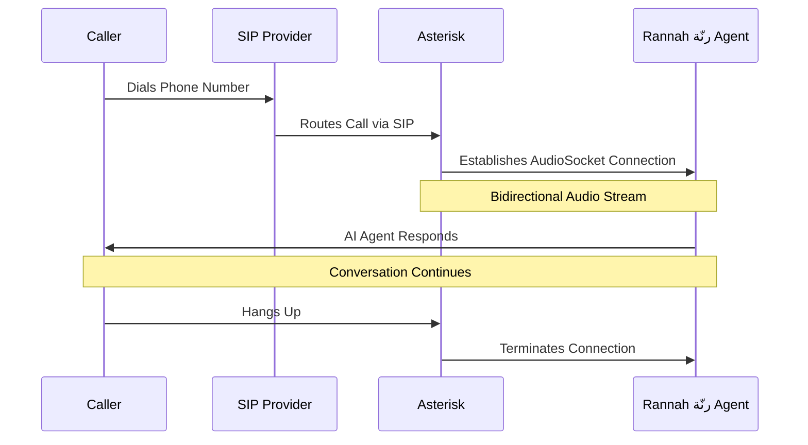

# SIP Trunking with Rannah رنّة

SIP (Session Initiation Protocol) trunking allows you to connect your own phone numbers and telephony infrastructure to Rannah رنّة's AI voice agents. This enables you to receive inbound calls directly from your SIP provider and route them to your configured agents.

## What is SIP Trunking?

SIP trunking is a method of sending voice and other unified communications services over the internet. It replaces traditional phone lines with a virtual connection that allows you to make and receive calls through your internet connection.

## Key Benefits

<CardGroup cols={2}>
  <Card title="Bring Your Own Numbers" icon="phone">
    Use your existing phone numbers from any SIP provider
  </Card>
  <Card title="Lower Costs" icon="dollar-sign">
    Reduce telephony costs by using your own SIP trunk
  </Card>
  <Card title="Global Reach" icon="globe">
    Support international numbers from multiple providers
  </Card>
  <Card title="Full Control" icon="sliders">
    Complete control over call routing and configuration
  </Card>
</CardGroup>

## How It Works

The SIP trunking integration consists of three main components:

### 1. SIP Provider (Your Trunk)
Your external SIP trunk provider (e.g., Twilio or Peoplefone) that supplies phone numbers and handles call routing.

### 2. Rannah رنّة SIP Server
The Rannah رنّة SIP server is a fully managed SIP server that acts as a bridge between your SIP provider and Rannah رنّة. This server:
- Receives calls from your SIP trunk
- Routes calls to the correct AI agent
- Handles bidirectional audio streaming

## System Architecture

## Use Cases

<AccordionGroup>
  <Accordion title="Customer Support Hotlines">
    Route your support phone numbers to AI agents that can handle common inquiries, schedule appointments, and escalate to human agents when needed.
  </Accordion>
  
  <Accordion title="Sales & Lead Qualification">
    Use your business phone numbers with AI agents to qualify leads, answer product questions, and book demos 24/7.
  </Accordion>
  
  <Accordion title="Appointment Booking">
    Connect your appointment line to an AI agent that can check availability, book appointments, and send confirmations.
  </Accordion>
  
  <Accordion title="Order Status & Tracking">
    Allow customers to call your order hotline and get instant updates on their orders through AI-powered voice interactions.
  </Accordion>
  
  <Accordion title="Multi-Region Operations">
    Set up local phone numbers in different countries and route them to region-specific AI agents.
  </Accordion>
</AccordionGroup>

## What You'll Need

Before setting up SIP trunking, ensure you have:

<Steps>
  <Step title="A SIP Trunk Provider">
    An account with a SIP provider like Twilio or Peoplefone
  </Step>
  
  <Step title="Phone Numbers">
    At least one phone number provisioned with your SIP provider
  </Step>
  
  <Step title="SIP Server Access">
    The Rannah رنّة SIP server (automatically provided with your account)
  </Step>
  
  <Step title="Configured AI Agent">
    A Rannah رنّة voice-enabled AI agent ready to handle calls
  </Step>
</Steps>

## Supported SIP Providers

Our SIP trunking integration is compatible with most standard SIP providers, including:

- **Twilio** - Popular cloud communications platform
- **Peoplefone** - European telecommunication provider. Since its founding in Switzerland

  </img> 
  </img>

## Next Steps

Ready to get started? Follow our step-by-step guides:

<CardGroup cols={2}>
  <Card title="Quick Start Guide" icon="rocket" href="/voice/sip-trunking/quick-start">
    Get your first SIP trunk connected in minutes
  </Card>
  <Card title="Add SIP Provider" icon="plus" href="/voice/sip-trunking/adding-provider">
    Learn how to add and configure a SIP provider
  </Card>
  <Card title="Configure Phone Numbers" icon="hashtag" href="/voice/sip-trunking/phone-numbers">
    Map phone numbers to your AI agents
  </Card>
  <Card title="Understanding the Server" icon="server" href="/voice/sip-trunking/asterisk-setup">
    Learn how the SIP server works behind the scenes
  </Card>
</CardGroup>

<Note>
  **Important**: The SIP server is automatically provided with your Rannah رنّة account. You simply need to configure your SIP provider to route calls to the provided server address.
</Note>

## Pricing Considerations

When using SIP trunking, consider the following costs:

- **Plan access (v2-2026)**: Voice / SIP is included on **Business+**, or via the Voice ($29/mo) / SIP trunk ($15/mo) add-ons
- **SIP Provider Charges**: Your SIP trunk provider will charge for phone numbers and call minutes
- **Rannah رنّة Voice Minutes**: Standard Rannah رنّة voice pricing applies ($0.020/min platform fee + STT/TTS or realtime STS + LLM) — see [Voice pricing](/voice/pricing)
- **SIP Server Access**: Included once voice is unlocked (no additional server hosting fees)

<Tip>
  Using your own SIP trunk can significantly reduce costs compared to traditional telephony, especially for high-volume operations or international calling. The SIP server is included, so you only pay for your SIP provider and Rannah رنّة voice usage.
</Tip>
