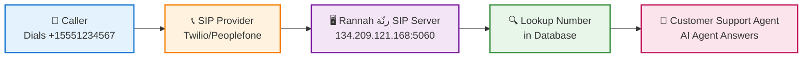

# Managing Phone Numbers

Phone numbers are the entry points for callers to reach your AI agents. This guide covers everything about adding, configuring, and managing phone numbers with your SIP trunks.

## Understanding Phone Numbers

Each phone number in your SIP trunk can be mapped to a specific AI agent. When someone calls that number:

1. Your SIP provider routes the call to the Asterisk server
2. The Asterisk server looks up the phone number configuration
3. The call is connected to the assigned AI agent
4. Your agent handles the conversation in real-time



## Adding a Phone Number

### Prerequisites

Before adding a phone number, ensure:

- ✅ You have at least one SIP provider configured
- ✅ The phone number is provisioned with your SIP provider
- ✅ You have a voice-enabled AI agent ready
- ✅ Your SIP provider is routing calls to the Asterisk server

### Step-by-Step Guide

<Steps>
  <Step title="Navigate to Your SIP Provider">
    On the SIP management page, find the SIP provider you want to add a number
    to
  </Step>

  <Step title="Click 'Add Number'">
    Click the **"Add Number"** button on the provider card
  </Step>

  <Step title="Fill in Number Details">
    Enter the following information in the modal: - **Phone Number**: The number
    in E.164 format - **Agent**: Select which AI agent will handle calls
  </Step>

  <Step title="Save Configuration">
    Click **"Add Number"** to save the phone number configuration
  </Step>
</Steps>

</img>

## Phone Number Configuration

### Required Fields

<ParamField path="number" type="string" required>
  **Phone Number** The phone number in international E.164 format. **Format
  Rules:** - Must start with a plus sign (+) - Include country code - No spaces,
  dashes, or parentheses - Only digits after the plus sign **Examples:** - ✅
  `+15551234567` (United States) - ✅ `+442071234567` (United Kingdom) - ✅
  `+61212345678` (Australia) - ✅ `+81312345678` (Japan) - ✅ `+33123456789`
  (France) - ❌ `5551234567` (missing + and country code) - ❌ `+1 (555)
  123-4567` (contains spaces and parentheses) - ❌ `+1-555-123-4567` (contains
  dashes)
</ParamField>

<ParamField path="agentId" type="string" required>
  **Agent** The AI agent that will handle incoming calls to this number.
  **Requirements:** - Agent must be voice-enabled - Agent must belong to the
  same workspace - Agent must have valid voice configuration Select from the
  dropdown list of your available agents. The dropdown shows: - Agent name
  (title)
</ParamField>

<ParamField path="trunkId" type="string">
  **Trunk ID** (Auto-filled) Automatically set to the SIP provider you're adding
  the number to. This field is not visible in the UI but links the phone number
  to the correct trunk.
</ParamField>

### Understanding E.164 Format

The E.164 format is the international standard for phone numbers:

```
+[Country Code][Area/City Code][Local Number]

Examples by Country:
+1 5551234567      (USA)
  │ └─────────────  10-digit national number
  └────────────────  Country code

+44 2071234567     (UK)
   │ └────────────  Local number with area code
   └──────────────  Country code

+61 212345678      (Australia)
   │ └────────────  Local number
   └──────────────  Country code
```

## Viewing Phone Numbers

### Expand a SIP Provider

To view all phone numbers for a SIP provider:

1. Click on the provider card or the chevron icon
2. The card expands to show all associated phone numbers
3. Each number displays:
   - Phone number
   - Assigned agent ID
   - Region (NA or EU)
   - Delete button

</img>

### Understanding the Number Count Badge

The provider card shows a badge with the number count:

```
[Provider Name]
[SIP Domain]
🏷️ 2 numbers
```

- Shows total numbers configured for this provider
- Updates automatically when you add or remove numbers
- Click anywhere on the card to see the list

## Managing Existing Numbers

### Deleting a Phone Number

<Warning>
  Deleting a phone number removes its configuration from Rannah رنّة but does NOT
  cancel the number with your SIP provider. The number will stop working until
  reconfigured.
</Warning>

To delete a phone number:

<Steps>
  <Step title="Expand the Provider">
    Click on the SIP provider to expand and view its phone numbers
  </Step>

  <Step title="Click Delete">
    Click the **Delete** button (trash icon) next to the phone number
  </Step>

  <Step title="Confirm Deletion">
    Confirm the deletion in the confirmation dialog
  </Step>
</Steps>

After deletion:

- The number is immediately removed from Rannah رنّة
- Calls to this number will fail until reconfigured
- The number count badge updates automatically
- The configuration is also removed from the Asterisk server

### Editing a Phone Number

Currently, you cannot directly edit a phone number's agent assignment. To change the agent:

<Steps>
  <Step title="Delete the Number">
    Remove the existing phone number configuration
  </Step>

  <Step title="Add It Again">
    Add the phone number again with the new agent selected
  </Step>
</Steps>

<Note>
  **Coming Soon**: Direct editing of phone number configurations will be
  available in a future update.
</Note>

## Multiple Numbers Configuration

### Multiple Numbers, Same Agent

You can route multiple phone numbers to the same agent. This is useful for:

- Different departments calling the same general support agent
- Multiple regional numbers for the same service
- A/B testing with different phone numbers

### Multiple Numbers, Different Agents

Route different numbers to different agents for specialized handling:

```
+15551234567 → Customer Support Agent
+15552345678 → Sales Agent
+15553456789 → Billing Agent
+15554567890 → Technical Support Agent
```

## Advanced Configurations

### Additional Parameters

The phone number configuration supports additional parameters (stored in the `additionalParams` field). While not currently exposed in the UI, these can be set via API:

```json
{
  "number": "+15551234567",
  "trunkId": "trunk-id-here",
  "agentId": "agent-id-here",
  "region": "na",
  "additionalParams": {
    "department": "sales",
    "language": "en",
    "timezone": "America/New_York",
    "priority": "high",
    "customGreeting": "Thank you for calling Sales"
  }
}
```

These parameters can be used for:

- Custom routing logic
- Analytics and reporting
- Agent-specific configuration
- Metadata tracking

## Number Limits and Quotas

Your Rannah رنّة plan determines how many phone numbers you can configure. On **v2-2026**:

| Plan | Twilio number slots |
|------|---------------------|
| Free / Starter / Pro | 0 (voice not included) |
| **Business** | 2 |
| **White Label** | 3 |
| **White Label Elite** | 5 |

Extra slots are **$3/mo** each (Twilio phone number add-on). Voice / SIP access starts on **Business**, or via the Voice / SIP add-ons on a lower tier.

When you approach or reach your limit:

- A warning appears when trying to add numbers
- The "Add Number" button may be disabled
- Consider upgrading your plan or removing unused numbers

## Troubleshooting Phone Numbers

### Common Issues

<AccordionGroup>
  <Accordion title="Calls Not Reaching Agent">
    **Symptoms:** - Phone rings but no agent answers - Call drops immediately -
    No conversation log in dashboard **Solutions:** - Verify the phone number is
    in E.164 format - Check that the agent is voice-enabled - Ensure the SIP
    provider is routing correctly - Verify the trunk is active and configured -
    Check Asterisk server logs for errors
  </Accordion>

  <Accordion title="Cannot Add Phone Number">
    **Symptoms:** - Form validation errors - "Phone number already exists" error
    - API errors when saving **Solutions:** - Ensure number is in correct E.164
    format (+15551234567) - Check if the number is already configured elsewhere
    - Verify you haven't reached your plan limit - Try adding the number via API
    if UI fails - Check browser console for error details
  </Accordion>

  <Accordion title="Wrong Agent Answering">
    **Symptoms:** - Different agent than expected answers - Agent doesn't have
    correct context **Solutions:** - Verify the correct agent is selected -
    Check if multiple numbers use the same agent - Confirm the number
    configuration in the UI - Review Asterisk dialplan routing - Check
    conversation logs for the agent ID
  </Accordion>

  <Accordion title="Number Deleted But Still Working">
    **Symptoms:** - Deleted number still receives calls - Old agent still
    answering **Solutions:** - Check if the number was re-added - Verify
    deletion on UI - Contact support if issue persists
  </Accordion>
</AccordionGroup>

### Validation Errors

Common validation errors when adding numbers:

| Error Message                 | Cause              | Solution                                          |
| ----------------------------- | ------------------ | ------------------------------------------------- |
| "Phone number is required"    | Empty number field | Enter a valid phone number                        |
| "Invalid phone number format" | Wrong format       | Use E.164 format (+15551234567)                   |
| "Agent is required"           | No agent selected  | Select an agent from dropdown                     |
| "Phone number already exists" | Duplicate number   | Use a different number or delete the existing one |
| "Trunk not found"             | Invalid trunk ID   | Ensure SIP provider exists                        |

## Best Practices

<CardGroup cols={2}>
  <Card title="Use Clear Naming" icon="tag">
    Document what each phone number is for in your own records
  </Card>

  <Card title="Test Immediately" icon="phone">
    Call each number right after configuration to verify it works
  </Card>

  <Card title="Monitor Call Logs" icon="list">
    Regularly check conversation logs to ensure numbers are working
  </Card>

  <Card title="Document Configuration" icon="book">
    Keep a spreadsheet of number → agent mappings
  </Card>

  <Card title="Plan for Scale" icon="chart-line">
    Design your numbering strategy before adding many numbers
  </Card>

  <Card title="Use Regions Wisely" icon="globe">
    Choose regions based on caller location for best latency
  </Card>
</CardGroup>

## Number Porting

If you want to port an existing phone number to your SIP provider:

<Steps>
  <Step title="Contact Your SIP Provider">
    Initiate the porting process with your SIP provider (not Rannah رنّة)
  </Step>

  <Step title="Wait for Port Completion">
    Number porting typically takes 7-21 business days
  </Step>

  <Step title="Add to Rannah رنّة">
    Once ported, add the number to your SIP trunk in Rannah رنّة
  </Step>

  <Step title="Test Thoroughly">
    Make test calls to ensure everything works correctly
  </Step>
</Steps>

<Warning>
  Number porting is handled entirely by your SIP provider. Rannah رنّة is not
  involved in the porting process.
</Warning>

## Analytics and Monitoring

### Tracking Number Performance

Monitor your phone numbers using:

1. **Conversation Logs**: View all calls in the Conversations tab
2. **Analytics Dashboard**: See call volume per number
3. **Agent Performance**: Track how each agent handles calls
4. **SIP Provider Dashboard**: Monitor call quality and reliability

### Key Metrics to Track

- Call volume per number
- Average call duration
- Agent response times
- Call success/failure rates
- Regional distribution of calls
- Peak calling hours

## Next Steps

<CardGroup cols={2}>
  <Card title="Asterisk Server Setup" icon="server" href="/voice/sip-trunking/asterisk-setup">
    Learn how the Asterisk server handles your calls
  </Card>

  <Card title="Call Analytics" icon="chart-line" href="/features/analytics">
    Track and analyze your call performance
  </Card>
</CardGroup>
